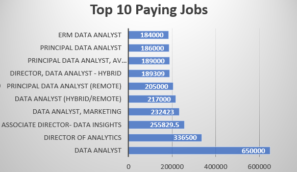
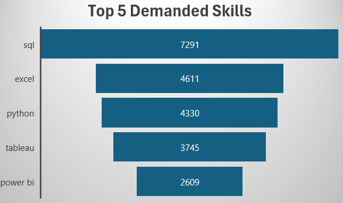
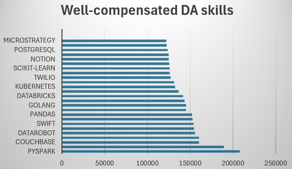

# Introduction
Dive into the data job market! focusing on data analyst roles, this project explores top-paying jobs, in-demand skills and where demand meets high salary in data analytics.
check out SQL queries here: []()
# Background
the main aim for this project to highlight top-paid and in-demand skills, streamlining others work to find optimum jobs
### the questions i wanted to answer through my queries were:
1. what are top-paying data analyst jobs?
2. what skills are required for these top paying jobs?
3. what skills are most in demand for data analysts?
4. which skills are associated with higher salaries?
5. what are the most optimal skills to learn?
# Tools I Used
 - **SQL:** backbone of my analysis, allowing me to query the database.
 - **PostgresSQL:** the chosen database managment.
 - **Visual Studio Code:** at which we execute our queries
 - **Git & GitHub:** essential for version control and sharing sql scripts & ensuring collaboration.
# The Analysis
Each query was written to identify a certain aspect in data analyst job market.

### 1. Top-paying Data Analyst Remote Jobs
- identify the top 10 highest-paying data analyst roles that are availble remotely.
- focuses om job postings with specified salaries (remove nulls).
- why? highlight the top-paying opportunities for data analysts, offering insights into employer


```sql
SELECT 
        job_id,
        job_title,
        company_dim.name AS company_name,
        job_location,
        job_schedule_type,
        salary_year_avg,
        job_posted_date
FROM 
        job_postings_fact
LEFT JOIN company_dim ON job_postings_fact.company_id = company_dim.company_id
WHERE 
        job_title_short = 'Data Analyst' AND
        salary_year_avg IS NOT NULL AND
        job_location = 'Anywhere'
ORDER BY 
        salary_year_avg DESC
LIMIT 10;
```


*Top 10 Paying Data Analyst Remote jobs*

### 2. What skills are required for Top-paying Data Analyst Remote jobs?
-add to the first query skills required for these roles

```sql
WITH top_paying_jobs AS(
SELECT 
        job_id,
        job_title,
        company_dim.name AS company_name,
        job_location,
        salary_year_avg
FROM 
        job_postings_fact
LEFT JOIN company_dim ON job_postings_fact.company_id = company_dim.company_id
WHERE 
        job_title_short = 'Data Analyst' AND
        salary_year_avg IS NOT NULL AND
        job_location = 'Anywhere'
ORDER BY 
        salary_year_avg DESC
LIMIT 10
)

/*we will use inner join in next query instead of left join, as we only need to get results for skills 
where jobs associated with actual skills excluding null values
*/

SELECT
     top_paying_jobs.*,
     skills
FROM top_paying_jobs
INNER JOIN skills_job_dim ON top_paying_jobs.job_id = skills_job_dim.job_id
INNER JOIN skills_dim ON skills_job_dim.skill_id = skills_dim.skill_id

ORDER BY  salary_year_avg DESC
```
[](data_job_analysis_project/Chart2.png)

### 3. What are the most in-demand skills for data analysts?
- identify top 5 demanded skills for Data Analysts
```sql
SELECT 
        skills,
        COUNT(*) AS demand_count
FROM job_postings_fact
INNER JOIN skills_job_dim ON job_postings_fact.job_id = skills_job_dim.job_id
INNER JOIN skills_dim ON skills_job_dim.skill_id = skills_dim.skill_id
WHERE job_title_short = 'Data Analyst' AND 
        job_work_from_home = TRUE
GROUP BY skills
ORDER BY demand_count DESC
LIMIT 5
```



### 4. What are top skills based on salary?
- look at average salary associated with each skill for DA positions
- reason: it helps job seekers to know skills associated with high salaries
```sql
SELECT 
        skills,
        round(AVG (salary_year_avg),0) AS salary

FROM job_postings_fact      

INNER JOIN skills_job_dim ON job_postings_fact.job_id = skills_job_dim.job_id

INNER JOIN skills_dim ON skills_job_dim.skill_id = skills_dim.skill_id

WHERE job_title_short = 'Data Analyst' AND 
        salary_year_avg IS NOT NULL AND
        job_work_from_home = TRUE

GROUP BY skills
ORDER BY salary DESC
LIMIT 25
```


*pyspark is the highest paying skill with average annual salary more than 200k*
### 5. what are the most optimum skills to learn?
reason: identify skills with high stability and financial benefits as well for job seekers
```sql
WITH skills_demand AS(
SELECT 
        skills_dim.skills,
        skills_dim.skill_id,
        COUNT(*) AS demand_count

FROM job_postings_fact

INNER JOIN skills_job_dim ON job_postings_fact.job_id = skills_job_dim.job_id

INNER JOIN skills_dim ON skills_job_dim.skill_id = skills_dim.skill_id

WHERE job_title_short = 'Data Analyst' AND 
        job_work_from_home = TRUE AND
        salary_year_avg IS NOT NULL

GROUP BY skills_dim.skill_id
), 


 skills_pay AS(
    SELECT 
        skills_dim.skills,
        skills_dim.skill_id,
        round(AVG (salary_year_avg),0) AS salary

FROM job_postings_fact      

INNER JOIN skills_job_dim ON job_postings_fact.job_id = skills_job_dim.job_id
INNER JOIN skills_dim ON skills_job_dim.skill_id = skills_dim.skill_id

WHERE job_title_short = 'Data Analyst' AND 
        salary_year_avg IS NOT NULL AND
        job_work_from_home = TRUE

GROUP BY skills_dim.skill_id
)

SELECT 
        skills_demand.skill_id,
        skills_demand.skills,
        salary,
        demand_count
FROM   skills_demand
INNER JOIN skills_pay  ON skills_demand.skill_id = skills_pay.skill_id
WHERE demand_count > 10
ORDER BY  salary DESC,demand_count DESC
LIMIT 25

-- writing same query more precisely

SELECT 
        skills_dim.skill_id,
        skills_dim.skills,
        round(AVG (salary_year_avg),0) AS salary,
        COUNT(job_postings_fact.job_id) AS demand_count
FROM   job_postings_fact
INNER JOIN skills_job_dim ON job_postings_fact.job_id = skills_job_dim.job_id
INNER JOIN skills_dim ON skills_job_dim.skill_id = skills_dim.skill_id
WHERE job_title_short = 'Data Analyst' AND 
        salary_year_avg IS NOT NULL AND
        job_work_from_home = TRUE 
GROUP BY skills_dim.skill_id
HAVING COUNT(job_postings_fact.job_id) > 10
ORDER BY  salary DESC,demand_count DESC
LIMIT 25
```
| Skill        | Salary  | Demand Count |
|--------------|---------|--------------|
| Go           | 115,320 | 27           |
| Confluence   | 114,210 | 11           |
| Hadoop       | 113,193 | 22           |
| Snowflake    | 112,948 | 37           |
| Azure        | 111,225 | 34           |
| BigQuery     | 109,654 | 13           |
| AWS          | 108,317 | 32           |
| Java         | 106,906 | 17           |
| SSIS         | 106,683 | 12           |
| Jira         | 104,918 | 20           |
| Oracle       | 104,534 | 37           |
| Looker       | 103,795 | 49           |
| NoSQL        | 101,414 | 13           |
| Python       | 101,397 | 236          |
| R            | 100,499 | 148          |
| Redshift     | 99,936  | 16           |
| Qlik         | 99,631  | 13           |
| Tableau      | 99,288  | 230          |
| SSRS         | 99,171  | 14           |
| Spark        | 99,077  | 13           |
| C++          | 98,958  | 11           |
| SAS          | 98,902  | 63           |
| SQL Server   | 97,786  | 35           |
| JavaScript   | 97,587  | 20           |


# Wht I Learned
Throughout my learning journey, I have apllied a lot of concepts like:

-**🍕 Subqueries & CTEs, get used to using complex subqueries within my query and using join functions effectively**

-**🗝️ Analytical Thinking, leveled up my problem solving skills, turning questions into insightful queries & simple vizs**

-**🔗Data Aggregation with GROUP BY and turned aggregate functions like COUNT() & AVG()**

# Conclusions
### Insights
1. **Top-paying data analyst jobs**: the highest paying jobs for data analyst that allow working remotely, the highest salary was $650,000.
2. **Skills for Top-paying Jobs**: High-paying data analyst jobs require advanced proficiency in sql, suggesting it's a critical skill for earning a top salary.
3. **Most In-demand Skills**: SQL is also the most demanded skill in Data analyst job market making it essential for job-seekers.
4. **Skills with higher salaries**: these are specialized skills such as svn & solidity are associated with highest average salaries, indicating a premium on niche expertise.
5. **optimum skills for job market value**: SQL is among skills with high paying salaries, in addition it's the most demanded skill offering job stability too.
### closing thoughts
This project highlights the importance of continous learning and adaptation to emerging trends in data analytics field.
